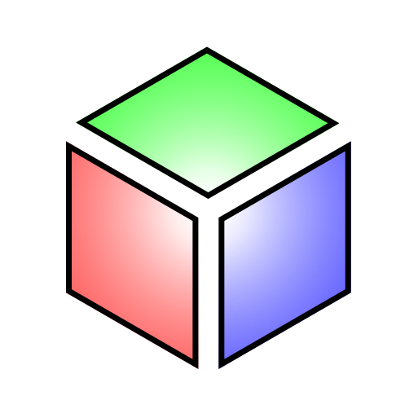
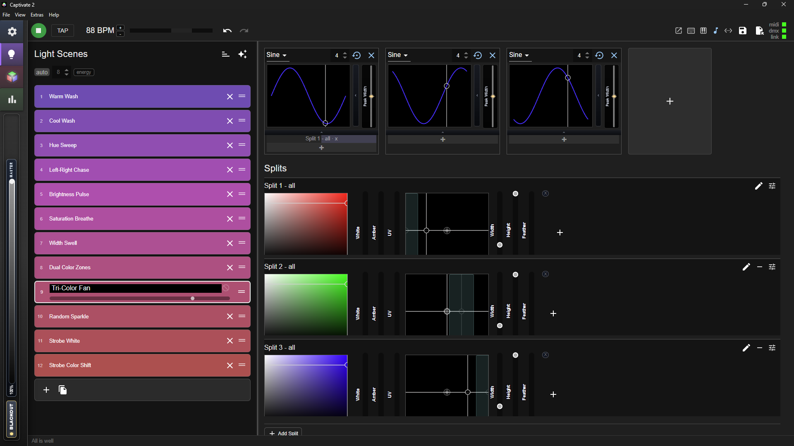
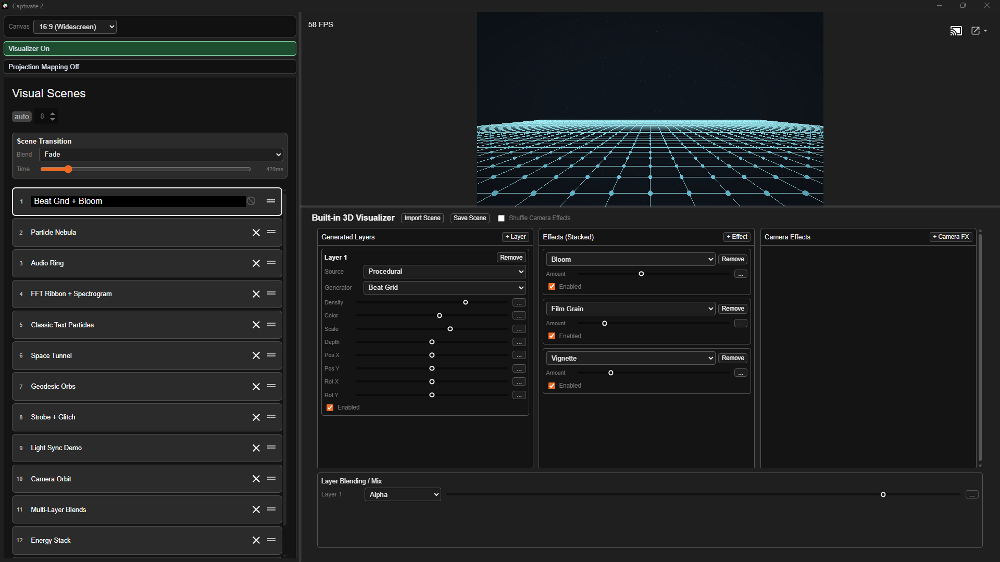
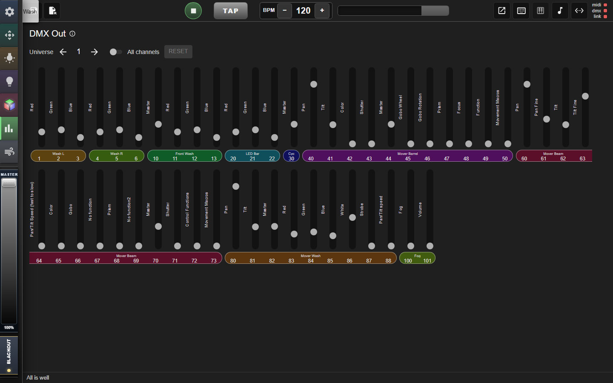

# Captivate 2

<p align="center">
  
</p>

**Visual & lighting synth** — live DMX, visuals, and laser control synchronized to music.

[CaptivateSynth.com](https://CaptivateSynth.com)

Captivate 2 builds on the original [Captivate](https://github.com/spensbot/captivate) by Spencer (@spencbot) and contributions from @fwcd’s fork. This project continues development with new features and UI improvements after the original line was discontinued.

## Highlights

- **DMX lighting** — fixture library, community online fixtures (QLC+, Open Fixture Library, Captivate library), import/export, multi-universe USB and Art-Net, spatial fixture layout
- **Synth-style control** — LFOs, modulation, pads, randomizers, MIDI and keyboard mapping
- **Visuals** — built-in visualizers and effects, synced to the active light scene
- **Multi-window UI** — detached pages for mixer, laser, 3D lighting preview, and more
- **Ableton Link** — BPM and phase sync with [supported apps](https://www.ableton.com/en/link/products/)
- **LAN remote** — optional browser UI for scenes, modulation, and mixer ([docs](docs/remote-control.md))

Configure fixtures once; scenes stay portable when you add gear or change venues.

## In the app

<p align="center">
  <br />
  <em>Light scenes, splits, and modulation</em>
</p>

<p align="center">
  <br />
  <em>Audio-reactive visuals synced to your lighting</em>
</p>

<p align="center">
  <br />
  <em>DMX mixer for live channel control</em>
</p>

More walkthroughs: **[Wiki](https://github.com/NicholasTracy/captivate-2/wiki)**.

## Documentation

**[Wiki](https://github.com/NicholasTracy/captivate-2/wiki)** — setup and how-to guides: DMX, connections, light scenes & splits, modulation, MIDI mapping, mixer, remote control, and troubleshooting.

**[Project files and autosave](docs/PROJECTS.md)** — `.cap` / `.cfx` file pairing, selective loads, autosave behavior, and recovery pitfalls.

**[Audio input and music energy](docs/audio-input.md)** — audio setup, beat detection, Advanced Music Energy controls, and how live energy drives scenes and visuals.

**[Community fixture library](docs/CAPTIVATE-FIXTURE-LIBRARY.md)** — browse and share Captivate fixture definitions (no git required to contribute).

## Download

Installers for Windows, macOS, and Linux are on the [Releases](https://github.com/NicholasTracy/captivate-2/releases/latest) page.

### macOS install help

Captivate 2 is **not Apple-notarized** (no paid Developer Program). macOS may warn the first time you open the app — that is expected.

**Download the correct file for your Mac** ([full guide](docs/MACOS-INSTALL.md)):

| Mac type | Release file |
|----------|----------------|
| Apple Silicon (M1, M2, M3, M4…) | `Captivate.2-<version>-arm64.dmg` |
| Intel | `Captivate.2-<version>-x64.dmg` |

Check **About This Mac** → **Chip** (Apple M…) vs **Processor** (Intel).

**First launch:**

1. Open the DMG and drag **Captivate 2** to **Applications**.
2. In **Applications**, **right-click** **Captivate 2.app** → **Open** (not double-click the first time).
3. Click **Open** in the security dialog.
4. If still blocked: **System Settings → Privacy & Security → Open Anyway**.

If the app quits immediately on launch, reinstall using the **arm64** DMG on Apple Silicon (see [macOS install guide](docs/MACOS-INSTALL.md)).

## Video

[Introduction on YouTube](https://www.youtube.com/watch?v=6ZwQ97sySq0)

## Community

- [Wiki](https://github.com/NicholasTracy/captivate-2/wiki)
- [Discord](https://discord.gg/96DVPcMUUv)
- [GitHub Discussions](https://github.com/NicholasTracy/captivate-2/discussions)

## Developers

Captivate 2 is an **Electron** app. Native addons (MIDI, USB DMX, projectM bridge, and other `node-gyp` modules) must be built with **standalone Node.js** matching the repo’s engine — not an editor-bundled runtime.

### Requirements

| Requirement | Notes |
|-------------|--------|
| **Node.js** | `>= 25.9.0` (see `.node-version` and `package.json` `engines`) |
| **npm** | `>= 11.11.0` |
| **Python** | 3.11 recommended for `node-gyp` |
| **Git LFS** | Run `git lfs pull` after clone |
| **Git submodules** | `git submodule update --init --recursive` |

`npm run check:build-env` verifies Node/npm before packaging.

**macOS:** Xcode Command Line Tools  
**Windows:** Visual Studio 2022 with “Desktop development with C++”  
**Linux:** see the `Install Linux dependencies` step in [`.github/workflows/build.yml`](.github/workflows/build.yml)

### Clone and run

```bash
git clone https://github.com/NicholasTracy/captivate-2.git
cd captivate-2
git submodule update --init --recursive
git lfs pull
npm install
npm start
```

### Build installers

```bash
npm run package:win    # Windows
npm run package:mac    # macOS
npm run package:linux  # Linux
```

CI builds all three platforms on push and publishes assets when you push a version tag (e.g. `v1.0.0`). See [Releases](https://github.com/NicholasTracy/captivate-2/releases).

### More docs

- **[Wiki](https://github.com/NicholasTracy/captivate-2/wiki)** — user guides and troubleshooting
- [Project files and autosave](docs/PROJECTS.md)
- [Audio input and music energy](docs/audio-input.md)
- [Community fixture library](docs/CAPTIVATE-FIXTURE-LIBRARY.md)
- [Remote control (LAN)](docs/remote-control.md)
- [Audio input, beat clock, and music energy](docs/audio-input-sync.md)
- [Laser FB4 / Pangolin BEYOND](docs/laser-fb4-beyond.md)
- [Visualizer streaming (RTSP / NDI)](docs/visualizer-streaming.md)

---

Thanks to [electron-react-boilerplate](https://github.com/electron-react-boilerplate/electron-react-boilerplate) for the app boilerplate.

[MIT License](LICENSE)
