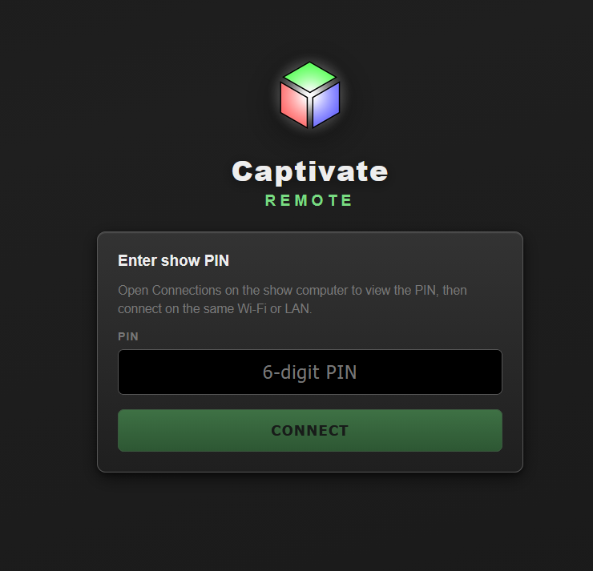

# Captivate remote control (LAN)

Optional **web UI** for phones and tablets on the same network. The show computer runs full Captivate; remotes control **scenes / modulation** and the **DMX mixer**, and can view **connections** and **audio** status.

## Enable on the show computer

1. Open **Connections** (ethernet icon in the status bar).
2. Scroll to **Remote control (LAN)**.
3. Turn on **Enable remote control**, note the **URL** and **PIN**.
4. Run `npm run build:remote` before packaging if the remote UI was not built yet (included in `npm run build`).

## Connect from a tablet or phone

1. Join the same Wi‑Fi / LAN as the show computer.
2. In Chrome (or any modern browser), open the URL shown (e.g. `http://192.168.1.42:8765`).
3. Enter the **PIN** from Connections.

4. Use **Scenes & modulation** or **DMX mixer** tabs; open **Connections** from the status bar for DMX/MIDI/Link settings.

## Security

- Intended for **trusted local networks** only.
- Use a strong PIN; regenerate if shared with too many people.
- Firewall may need to allow inbound TCP on the chosen port (default **8765**).

## Not available on remote

Visualizer, fixture editor, Laser ILDA, Lighting 3D, wLED, MIDI learn, keyboard shortcuts, save/load dialogs. Audio **capture** stays on the show computer; remotes see **meters** and can change audio **settings** that sync to the host.
