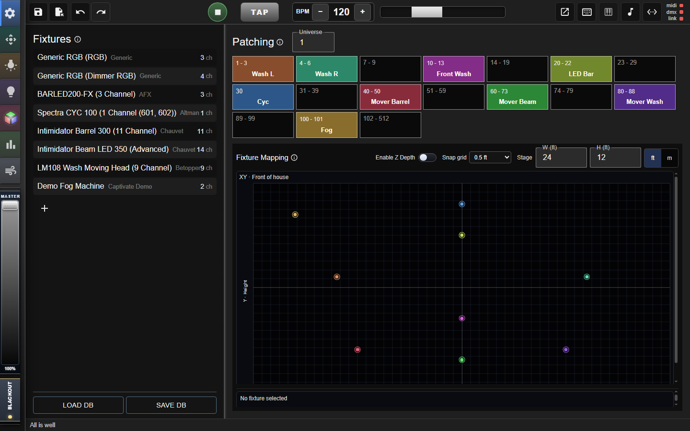
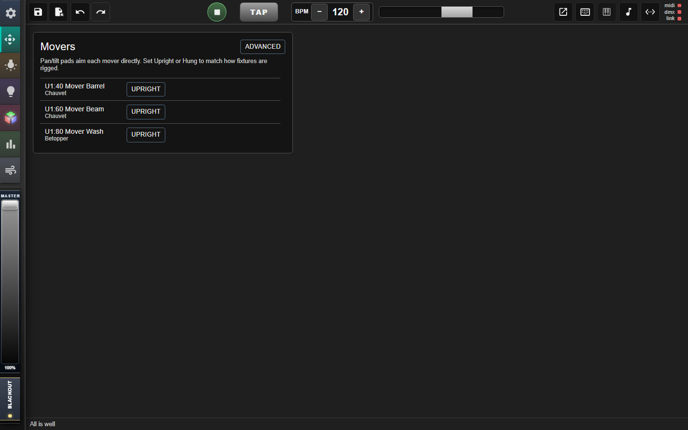
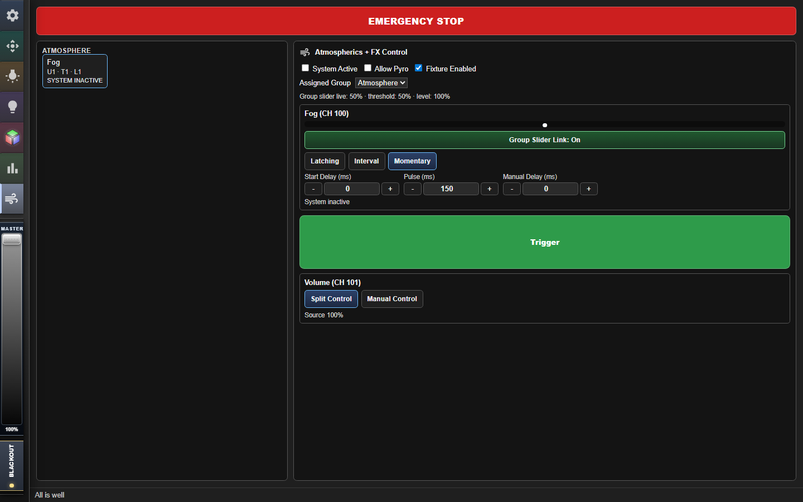
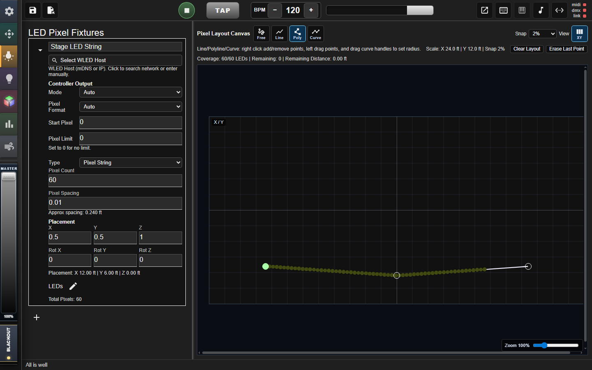
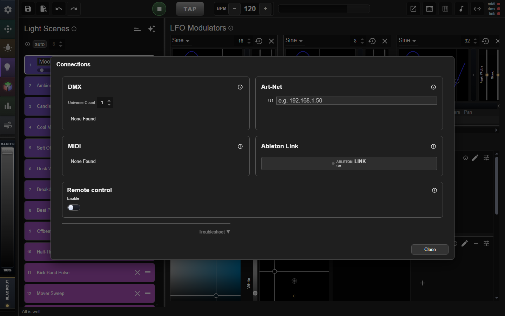
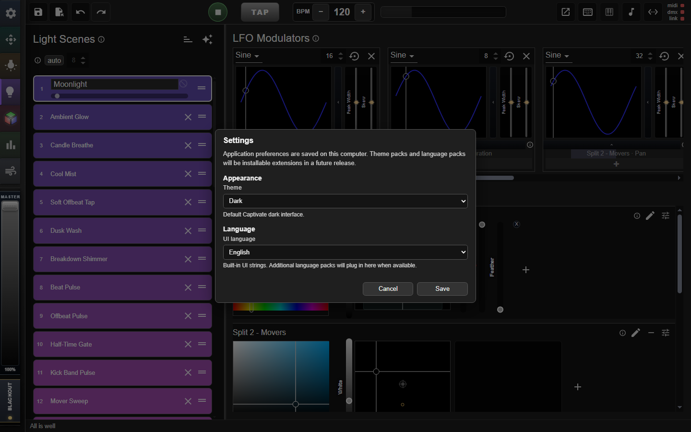
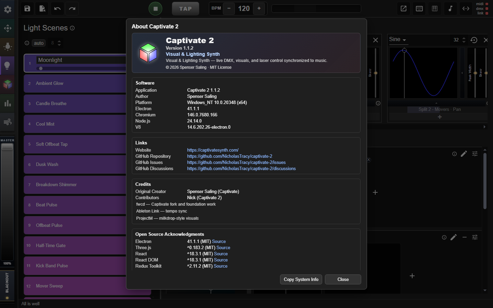
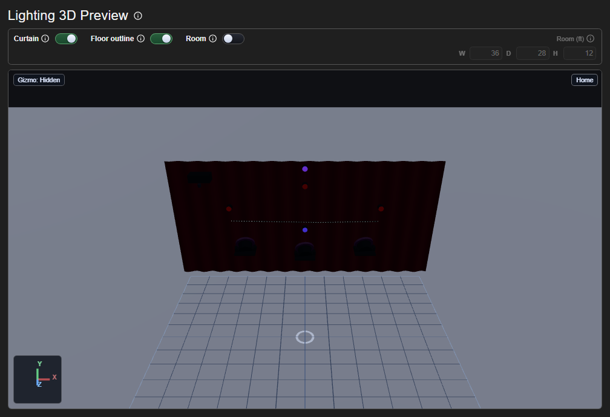
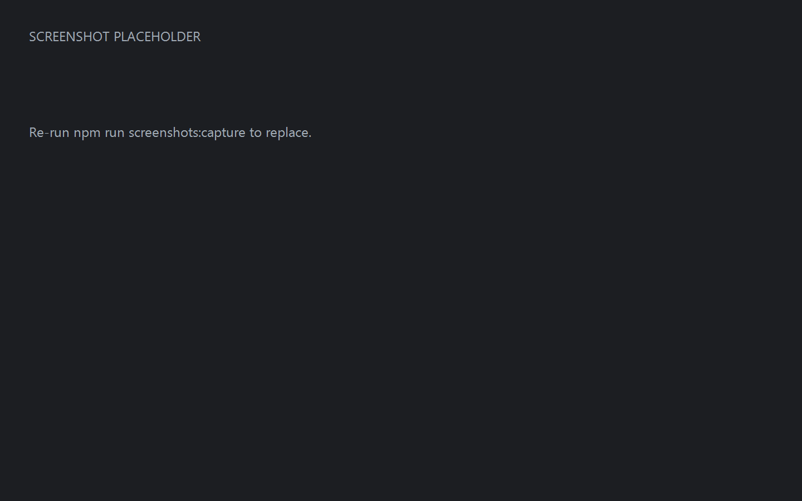

# Screenshots

Generated from `tools/screenshots/manifest.json`. Images live in-repo under `docs/screenshots/`.

Hotlink pattern:

```
https://raw.githubusercontent.com/NicholasTracy/captivate-2/Main/docs/screenshots/<file>.png
```

## Light scenes and modulation

Light scenes, splits, and modulation


## Fixture patch / DMX universe

Patch fixtures, groups, and DMX addresses



## DMX mixer

DMX mixer for live channel control


## Movers

Mover calibration, groups, and floor bounds

 _(image missing — run capture)_

## Atmospherics

Atmosphere / effect fixtures

 _(image missing — run capture)_

## LED layouts

LED strip / WLED layout editing



## Connections

DMX, MIDI, Link, audio, and remote connections



## Settings

Application settings

 _(image missing — run capture)_

## About

About Captivate 2

 _(image missing — run capture)_

## Visualizer

Audio-reactive visuals synced to your lighting


## 3D lighting preview

3D stage lighting preview

 _(image missing — run capture)_

## Laser

Laser control window

 _(image missing — run capture)_
